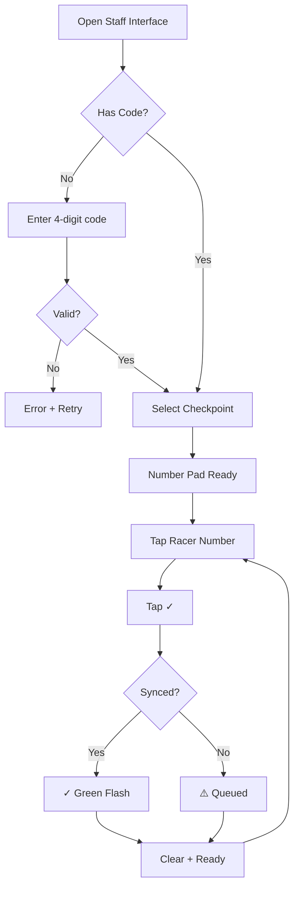
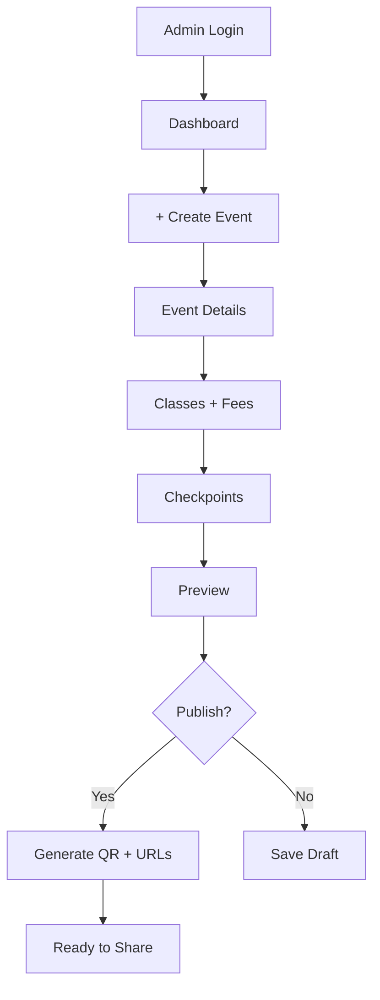
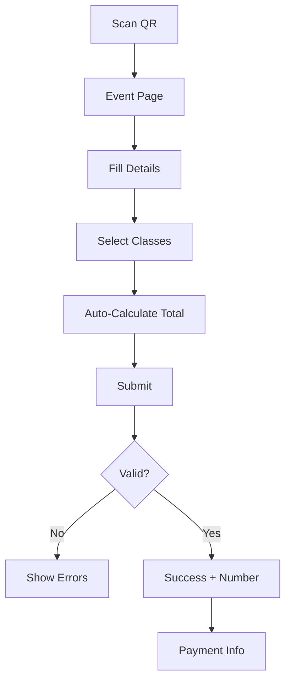
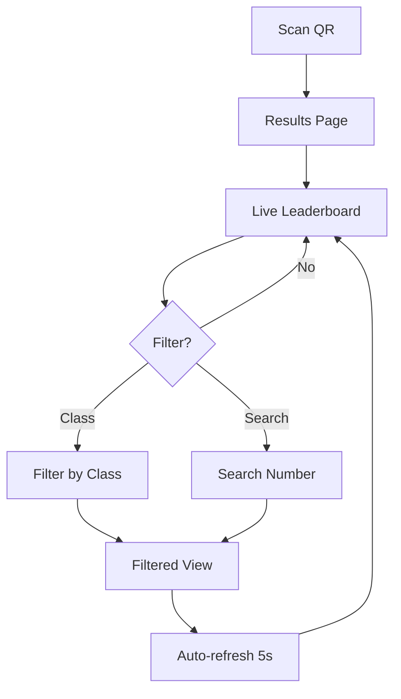
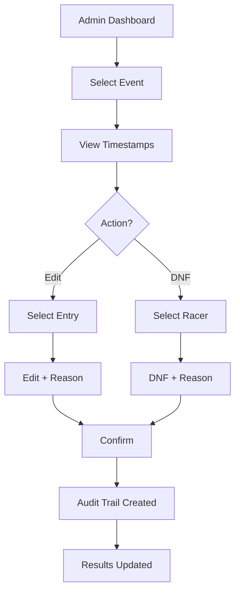

# UX Design Specification - EnduroRaceManager

**Author:** ครูA
**Date:** 2026-02-05

---

## Executive Summary

### Project Vision

EnduroRaceManager คือระบบจัดการแข่งขัน Enduro แบบ real-time ที่ออกแบบมาเพื่อแทนที่ Google Sheets workflow โดยเน้น:
- **ความเร็ว** - Real-time results ภายใน 2 วินาที
- **ความง่าย** - Staff ใช้งานได้ทันทีไม่ต้องเรียนรู้
- **ความน่าเชื่อถือ** - Audit trail ป้องกันข้อโต้แย้ง

### Target Users

| User | Primary Need | UX Priority |
|------|-------------|-------------|
| **Staff** | บันทึกเวลาด้วยการกด 2 ครั้ง | Critical - ใช้งานกลางแดด/ถุงมือ |
| **Admin** | จัดการงานแข่งครบในที่เดียว | High - Desktop + Mobile |
| **Viewer** | ดูผล real-time โดยไม่ต้อง login | Medium - QR scan access |
| **Racer** | สมัครหลายรุ่น คำนวณยอดอัตโนมัติ | Medium - Mobile form |

### Key Design Challenges

1. **Outdoor Mobile Use** - UI ต้องใช้งานได้กลางแดด ปุ่มใหญ่สำหรับถุงมือ
2. **Zero-Training Interface** - Staff ต้องใช้ได้ทันทีโดยไม่ต้องถาม
3. **Connection Resilience** - แสดง status ชัดเจน, graceful degradation
4. **Real-time Feedback** - Live updates ต้องชัดเจนว่าอัพเดทแล้ว

### Design Opportunities

1. **"One-Tap Recording"** - Staff กดครั้งเดียว = บันทึกสำเร็จ
2. **Live Leaderboard Excitement** - อันดับเปลี่ยนแบบ animate
3. **QR-First Access** - ทุก access point มี QR code
4. **Trust Indicators** - แสดง sync status และ audit trail

---

## Core User Experience

### Defining Experience

**Staff Checkpoint Interface** คือหัวใจของระบบ - ถ้า Staff ใช้ได้ = ทุกอย่างสำเร็จ

Core Loop: **เบอร์รถมา → กดเลข → กดบันทึก → เห็น ✓**

### Platform Strategy

| Aspect | Decision |
|--------|----------|
| **Type** | Progressive Web App (PWA-lite) |
| **Primary** | Mobile Web (Chrome/Safari) |
| **Secondary** | Desktop Web (Admin) |
| **Offline** | No (graceful degradation only) |

### Effortless Interactions

1. **Staff Recording**: Number pad + big green button = done
2. **Viewer Access**: QR scan → instant results (no login)
3. **Racer Registration**: Multi-select → auto-total → submit
4. **Admin Publish**: One click → QR + URL ready

### Critical Success Moments

| Moment | Visual Feedback Required |
|--------|-------------------------|
| Timestamp recorded | Big ✓ checkmark + haptic |
| Results updated | Row highlight animation |
| Registration complete | Success screen + number |
| Event published | QR code display |

### Experience Principles

1. **"Two Taps Max"** - Staff ต้องทำงานเสร็จใน 2 กด
2. **"See It Update"** - ทุก action ต้องมี visual feedback ทันที
3. **"QR-First"** - ทุกจุดเข้าถึงมี QR รองรับ
4. **"Trust Through Transparency"** - แสดง sync status ตลอด

---

## Desired Emotional Response

### Primary Emotional Goals

| User | Target Emotion | Design Implication |
|------|---------------|-------------------|
| **Staff** | Confidence | Big ✓ confirmation, clear feedback |
| **Viewer** | Excitement | Animated updates, live indicators |
| **Racer** | Assurance | Success screen, number display |
| **Admin** | Control | Dashboard overview, quick actions |

### Emotional Journey

**First Impression:** Relief - "นี่ง่ายกว่าที่คิด"
**During Use:** Confidence - "ฉันรู้ว่าต้องทำอะไร"
**After Success:** Pride - "ทำได้แล้ว ไม่ต้องถามใคร"
**On Error:** Trust - "ระบบบอกว่าต้องทำอะไร"

### Design Implications

1. **Instant Feedback** - ทุก action ต้องมี visual response ทันที
2. **Large Confirmations** - Success states ต้องชัดเจน ใหญ่ ไม่พลาด
3. **Live Indicators** - แสดง pulse/animation เมื่อข้อมูลอัพเดท
4. **Error Recovery** - แสดง error + วิธีแก้ไข ไม่ใช่แค่ error message

### Emotional Design Principles

1. **"No Doubt"** - User ต้องไม่สงสัยว่า action สำเร็จหรือยัง
2. **"Celebrate Success"** - แสดง success state อย่างชัดเจน
3. **"Stay Connected"** - แสดง connection status ตลอดเวลา
4. **"Recover Gracefully"** - Error ต้องมี next step ชัดเจน

---

## UX Pattern Analysis & Inspiration

### Inspiring Products Analysis

| Category | Inspiration | Key Learning |
|----------|-------------|--------------|
| **Input UI** | Calculator app | Large buttons, instant feedback, no mistakes |
| **Real-time** | Live Score apps (FlashScore, FotMob) | Row animations, auto-update without refresh |
| **Multi-select** | E-commerce checkout | Checkbox list → auto-calculate total |
| **Quick Access** | QR Payment apps (PromptPay) | Scan → instant action, no typing |

### Transferable UX Patterns

**Navigation Patterns:**
- **Tab-based navigation** - สำหรับ Staff แยก Checkpoints ชัดเจน
- **QR-first entry** - Viewer/Racer เข้าถึงได้ทันทีไม่ต้องพิมพ์ URL

**Interaction Patterns:**
- **Calculator-style input** - ปุ่มใหญ่ กดได้แม้ใส่ถุงมือ
- **Optimistic UI** - แสดง success ทันที ก่อน confirm จาก server
- **Pull-to-refresh + Auto-update** - รองรับทั้ง manual และ automatic

**Visual Patterns:**
- **High contrast** - มองเห็นกลางแดด
- **Row highlight animation** - เห็นชัดว่าอันไหนอัพเดท
- **Status badges** - LIVE, SYNCING, OFFLINE แสดงตลอด

### Anti-Patterns to Avoid

1. ❌ **Small touch targets** - ปุ่มเล็กกว่า 48px ใช้ไม่ได้กลางแดด/ถุงมือ
2. ❌ **Silent success/failure** - ไม่มี feedback = ไม่รู้ว่าสำเร็จหรือไม่
3. ❌ **Manual refresh only** - Real-time ต้อง auto-update
4. ❌ **Login for public views** - Viewer ต้องดูได้ทันทีไม่ต้อง login
5. ❌ **Multi-step for simple actions** - Staff recording ต้อง 2 กดจบ
6. ❌ **No connection indicator** - ต้องรู้ว่า online/offline ตลอด

### Design Inspiration Strategy

**What to Adopt:**
- Calculator-style number pad (ปุ่มใหญ่, feedback ทันที)
- Live score row animations (อันดับเปลี่ยนแบบ smooth)
- QR-first access pattern (scan = เข้าถึง)

**What to Adapt:**
- E-commerce checkout → ง่ายกว่า (ไม่ต้อง login, payment แยก)
- Live score complexity → เรียบง่ายกว่า (เน้น leaderboard เดียว)

**What to Avoid:**
- Social features (ไม่จำเป็นสำหรับ race timing)
- Complex filtering (เก็บไว้สำหรับ Admin เท่านั้น)
- Notification spam (แค่ sync status พอ)

---

## Design System Foundation

### Design System Choice

**Tailwind CSS + shadcn/ui** - Themeable component library ที่เหมาะกับ Next.js

### Rationale for Selection

1. **Tech Stack Alignment** - Perfect match กับ Next.js + Tailwind CSS ที่กำหนดไว้
2. **Speed vs. Customization Balance** - ได้ทั้ง proven components และ full customization
3. **Accessibility Built-in** - Radix UI primitives มี a11y ครบถ้วน
4. **Outdoor Optimization** - ปรับ touch targets และ contrast ได้ตามต้องการ
5. **Single Developer Friendly** - Copy-paste components, ไม่ต้อง build from scratch

### Implementation Approach

- Copy-paste components จาก shadcn/ui ตามต้องการ
- Customize via `tailwind.config.js` สำหรับ colors, sizes, spacing
- สร้าง custom components เฉพาะที่จำเป็น (NumberPad, LiveBadge, StatusIndicator)

### Customization Strategy

| Element | Standard | EnduroRaceManager |
|---------|----------|-------------------|
| **Touch Target** | 44px | 48px min, 64px Staff buttons |
| **Font Size** | 16px base | 18px base, 24px headings |
| **Contrast** | WCAG AA | WCAG AAA (outdoor visibility) |
| **Spacing** | 4px base | 8px base (glove-friendly) |
| **Border Radius** | 6px | 8px (softer, more visible) |

---

## Defining Core Experience

### The Defining Interaction

**"กดเลข → กดบันทึก → เห็น ✓"** - Staff Checkpoint Recording

เปรียบเทียบกับ products อื่น:
- Tinder = Swipe to match
- Uber = One tap to ride
- **EnduroRaceManager = Tap-Tap-Done**

### User Mental Model

| Aspect | Current (Google Sheets) | EnduroRaceManager |
|--------|------------------------|-------------------|
| **Process** | เปิด Sheet → หาแถว → พิมพ์เวลา → กด Enter | กดเลข → กด ✓ |
| **Feedback** | ไม่มี (ต้องมองหาแถวเอง) | Big ✓ + haptic + sound |
| **Error Risk** | พิมพ์ผิดแถว = หายไปเลย | ไม่มี wrong row (เลือกก่อนกด) |
| **Speed** | 5-10 วินาที | < 2 วินาที |

### Success Criteria

| Criteria | Target | Measurement |
|----------|--------|-------------|
| **Speed** | < 2 seconds | Time from racer arrival to ✓ |
| **Accuracy** | < 1% error | Wrong entries / total entries |
| **Training** | 0 minutes | Staff ใช้ได้ทันทีไม่ต้องสอน |
| **Confidence** | 100% | Staff รู้ว่า action สำเร็จ |

### Experience Mechanics

**Interface Layout:**
```
┌─────────────────────────────────┐
│  Last: 42 ✓  | 17 ✓  | 88 ✓    │  ← Recent history
├─────────────────────────────────┤
│         [ 0 5 3 ]              │  ← Current input (large)
├───────┬───────┬───────┬────────┤
│   1   │   2   │   3   │        │
├───────┼───────┼───────┤   ⌫   │
│   4   │   5   │   6   │        │
├───────┼───────┼───────┼────────┤
│   7   │   8   │   9   │        │
├───────┼───────┴───────┼────────┤
│   C   │       0       │   ✓   │
└───────┴───────────────┴────────┘
```

**Flow Sequence:**
1. **Initiation:** หน้าจอพร้อมกด, auto-focus ที่ input
2. **Interaction:** กดตัวเลข (64px buttons), เห็นเลขใหญ่ตรงกลาง
3. **Feedback:** กด ✓ → green flash + haptic + sound
4. **Completion:** เลขย้ายไป history, input clear, พร้อมคนต่อไป

---

## Visual Design Foundation

### Color System

| Token | Color | Hex | Usage |
|-------|-------|-----|-------|
| **primary** | emerald-600 | #059669 | Actions, success states |
| **secondary** | slate-700 | #334155 | Text, secondary UI |
| **success** | green-500 | #22c55e | Confirmations, recorded |
| **warning** | amber-500 | #f59e0b | Syncing, pending |
| **error** | red-500 | #ef4444 | Errors, DNF status |
| **background** | slate-50 | #f8fafc | Page background |
| **surface** | white | #ffffff | Cards, inputs |

**High Contrast Mode:** สำหรับใช้งานกลางแดด - เพิ่ม contrast ทุก element

### Typography System

**Font Stack:**
- **Sans:** Inter (UI text)
- **Mono:** JetBrains Mono (numbers, times)

**Type Scale:**

| Token | Size | Usage |
|-------|------|-------|
| `text-base` | 18px | Body text |
| `text-lg` | 20px | Important info |
| `text-xl` | 24px | Section headings |
| `text-4xl` | 48px | Number pad display |

### Spacing & Layout

**Spacing Scale (8px base):**
- `space-1` = 8px (tight)
- `space-2` = 16px (component padding)
- `space-3` = 24px (section gaps)
- `space-4` = 32px (major sections)

**Layout Principles:**
1. Full-width mobile (maximize touch area)
2. Card-based sections
3. Sticky headers
4. Bottom-anchored primary actions

### Accessibility

| Requirement | Implementation |
|-------------|----------------|
| Contrast | WCAG AAA (7:1) |
| Touch targets | 48px min, 64px primary |
| Focus states | 2px emerald ring |
| Motion | Reduced motion support |

---

## Design Direction Decision

### Design Directions Explored

| Direction | Style | Best For |
|-----------|-------|----------|
| **A** | Clean & Minimal | Focus-only tasks |
| **B** | Dashboard-style | Context-aware tasks |
| **C** | Full-screen Action | Single-action tasks |

### Chosen Direction

**Direction B: Dashboard-style** - Balance ระหว่าง context และ focus

### Design Rationale

1. **Context Awareness** - Staff ต้องการเห็น checkpoint ไหน, กี่คนแล้ว
2. **History Strip** - ช่วยตรวจสอบว่าบันทึกถูกต้อง
3. **Status Indicator** - สร้าง confidence ว่า synced แล้ว
4. **Outdoor Compatible** - ยังคง clean พอสำหรับ high contrast

### Implementation Approach

- **Responsive:** Desktop = sidebar layout, Mobile = stacked
- **Components:** Card-based sections with shadcn/ui
- **Navigation:** Sticky header with status badges
- **Actions:** Bottom-anchored primary action buttons

---

## User Journey Flows

### Staff Checkpoint Recording

**Entry:** 4-digit access code → Select checkpoint → Number pad ready



**Key Moments:** Code entry (once) → Number pad (repeat) → ✓ feedback (instant)

### Admin Create Event

**Entry:** Login → Dashboard → Create Event wizard



**Key Moments:** Wizard steps → One-click publish → QR codes ready

### Racer Registration

**Entry:** QR scan → Event page (no login required)



**Key Moments:** QR entry → Multi-select classes → Auto-total → Success screen

### Viewer Results

**Entry:** QR scan → Live leaderboard (no login required)



**Key Moments:** Instant access → Live updates → Simple filtering

### Admin Edit/DNF

**Entry:** Dashboard → Event → Manage timestamps



**Key Moments:** Select → Edit with reason → Audit trail created

### Journey Patterns

| Pattern | Usage | Implementation |
|---------|-------|----------------|
| **QR-First Entry** | Racer, Viewer | No login, instant access |
| **2-Tap Core Action** | Staff | Number → ✓ |
| **Auto-Calculate** | Registration | Select → Total |
| **Optimistic UI** | All writes | Show success, retry bg |

### Flow Optimization Principles

1. **Minimize Steps** - ทุก journey สั้นที่สุดที่ทำได้
2. **No Dead Ends** - ทุก error มี recovery path
3. **Progressive Disclosure** - แสดงแค่ที่จำเป็น
4. **Clear Feedback** - ทุก action มี visual response

---

## Component Strategy

### Design System Components (shadcn/ui)

| Component | Usage | Customization |
|-----------|-------|---------------|
| **Button** | Actions, confirms | Size: lg (48px), xl (64px Staff) |
| **Input** | Text fields | Size: lg, larger padding |
| **Card** | Section containers | Shadow: sm, radius: 8px |
| **Badge** | Status indicators | Custom colors for LIVE/SYNCING |
| **Table** | Leaderboard, lists | Row hover, highlight animations |
| **Dialog** | Modals, confirmations | Responsive sizing |
| **Form** | Registration, settings | Larger labels, spacing |
| **Checkbox** | Multi-select classes | Size: lg, clear checkmark |
| **Tabs** | Checkpoint selection | Large touch targets |
| **Toast** | Notifications | Duration: 3s, position: top |

### Custom Components

#### NumberPad

**Purpose:** Staff timestamp input with large touch targets

| Spec | Value |
|------|-------|
| **Button Size** | 64px × 64px minimum |
| **Display Font** | 48px JetBrains Mono |
| **Gap** | 8px between buttons |
| **States** | Default, Pressed (scale 0.95), Disabled |
| **Feedback** | Haptic on tap, sound on confirm |

```
Props:
- value: string
- onChange: (value: string) => void
- onSubmit: () => void
- disabled?: boolean
- maxLength?: number (default: 3)
```

#### LiveBadge

**Purpose:** Real-time connection status indicator

| Variant | Color | Icon | Animation |
|---------|-------|------|-----------|
| **live** | green-500 | ● | Pulse |
| **syncing** | amber-500 | ↻ | Spin |
| **offline** | red-500 | ○ | None |
| **error** | red-600 | ⚠ | None |

```
Props:
- status: 'live' | 'syncing' | 'offline' | 'error'
- size?: 'sm' | 'md' | 'lg'
- showLabel?: boolean
```

#### HistoryStrip

**Purpose:** Display recent recordings for verification

| Spec | Value |
|------|-------|
| **Items** | Last 5 entries |
| **Animation** | Slide left on new entry |
| **Undo Window** | 5 seconds |
| **Item Format** | `{number} ✓` or `{number} ⚠` |

```
Props:
- entries: Array<{ id: string, number: string, status: 'synced' | 'pending' }>
- onUndo?: (id: string) => void
- maxItems?: number
```

#### LeaderboardRow

**Purpose:** Animated ranking display with live updates

| Spec | Value |
|------|-------|
| **Animation** | Slide up/down on rank change (300ms) |
| **Highlight** | Yellow flash on update (500ms) |
| **DNF Display** | Strikethrough + red badge |

```
Props:
- rank: number
- previousRank?: number
- racerNumber: string
- time: string
- gap?: string
- status: 'active' | 'dnf' | 'pending'
- isUpdated?: boolean
```

#### ClassSelector

**Purpose:** Multi-select registration with auto-calculation

| Spec | Value |
|------|-------|
| **Selection** | Checkbox multi-select |
| **Total** | Auto-calculate, sticky at bottom |
| **Validation** | Minimum 1 class required |

```
Props:
- classes: Array<{ id: string, name: string, fee: number }>
- selected: string[]
- onChange: (selected: string[]) => void
- currency?: string (default: '฿')
```

### Implementation Roadmap

| Phase | Components | Priority | Needed For |
|-------|------------|----------|------------|
| **1** | NumberPad, LiveBadge, HistoryStrip | P0 | Staff Recording (MVP) |
| **2** | LeaderboardRow, ClassSelector | P1 | Viewer, Racer Registration |
| **3** | QRDisplay, AuditModal, PrintCard | P2 | Admin, Print features |

---

## UX Consistency Patterns

### Feedback Patterns

| Action | Feedback | Duration |
|--------|----------|----------|
| **Tap button** | Scale 0.95 + haptic | 100ms |
| **Submit success** | Green flash + ✓ + haptic | 500ms |
| **Submit pending** | Yellow pulse + ⚠ | Until resolved |
| **Error** | Red shake + toast + haptic | 300ms + 3s toast |
| **Data update** | Row highlight yellow | 500ms |

### Loading States

| Context | Pattern |
|---------|---------|
| **Page load** | Skeleton screens (not spinners) |
| **Button action** | Disabled + spinner inside button |
| **Data refresh** | Subtle top progress bar |
| **Background sync** | LiveBadge status only |

### Empty States

| Screen | Message | Action |
|--------|---------|--------|
| **No events** | "ยังไม่มี Event" | + Create Event button |
| **No racers** | "ยังไม่มีผู้สมัคร" | Share QR code prompt |
| **No results** | "รอผลการแข่งขัน" | Auto-refresh indicator |

### Error Handling

| Error Type | Display | Recovery |
|------------|---------|----------|
| **Validation** | Inline under field | Auto-focus first error |
| **Network** | Toast + LiveBadge offline | Auto-retry + manual retry |
| **Auth** | Full-screen + redirect | Re-enter code / Re-login |
| **Server** | Toast + support contact | Retry button |

### Navigation Patterns

| Pattern | Usage | Implementation |
|---------|-------|----------------|
| **Sticky header** | All pages | Logo + Status + Menu |
| **Tab bar** | Staff checkpoints | Bottom on mobile |
| **Breadcrumb** | Admin nested pages | Top, collapsible |
| **Back button** | All sub-pages | Top-left, always visible |

### Form Patterns

| Pattern | Implementation |
|---------|----------------|
| **Labels** | Above input, 16px, slate-700 |
| **Placeholder** | Example format, slate-400 |
| **Required** | Red asterisk after label |
| **Error** | Red border + message below |
| **Success** | Green border + checkmark |
| **Help text** | Below input, 14px, slate-500 |

### Animation Guidelines

| Animation | Duration | Easing |
|-----------|----------|--------|
| **Button press** | 100ms | ease-out |
| **Modal open** | 200ms | ease-out |
| **Row reorder** | 300ms | ease-in-out |
| **Fade in** | 150ms | ease-out |
| **Success flash** | 500ms | ease-out |

**Reduced Motion:** All animations respect `prefers-reduced-motion`

---

## Responsive Design

### Breakpoints

| Breakpoint | Width | Primary Use |
|------------|-------|-------------|
| **sm** | 640px | Large phones landscape |
| **md** | 768px | Tablets |
| **lg** | 1024px | Small laptops |
| **xl** | 1280px | Desktop |

### Layout Strategy

| Screen | Staff | Admin | Viewer |
|--------|-------|-------|--------|
| **Mobile** | Full-width number pad | Stacked cards | Single column table |
| **Tablet** | Number pad + sidebar | 2-column grid | Table with filters |
| **Desktop** | N/A (mobile-only) | 3-column + sidebar | Full table + charts |

### Touch Targets

| Context | Minimum Size | Recommended |
|---------|--------------|-------------|
| **Primary action** | 48px | 64px |
| **Secondary action** | 44px | 48px |
| **Navigation** | 44px | 48px |
| **List items** | 48px height | 56px height |

### Mobile-First Approach

```css
/* Base styles for mobile */
.component { ... }

/* Tablet and up */
@media (min-width: 768px) { ... }

/* Desktop */
@media (min-width: 1024px) { ... }
```

---

## Accessibility

### WCAG Compliance Target

**Level AAA** for outdoor visibility requirements

### Color Contrast

| Element | Ratio | Requirement |
|---------|-------|-------------|
| **Body text** | 7:1 | AAA |
| **Large text (24px+)** | 4.5:1 | AAA |
| **UI components** | 3:1 | AA |
| **Focus indicators** | 3:1 | AA |

### Keyboard Navigation

| Key | Action |
|-----|--------|
| **Tab** | Move focus forward |
| **Shift+Tab** | Move focus backward |
| **Enter/Space** | Activate button |
| **Escape** | Close modal/cancel |
| **Arrow keys** | Navigate within component |

### Screen Reader Support

| Element | ARIA |
|---------|------|
| **LiveBadge** | `role="status"` `aria-live="polite"` |
| **NumberPad** | `role="group"` `aria-label="Number input"` |
| **Leaderboard** | `role="table"` with proper headers |
| **Toast** | `role="alert"` `aria-live="assertive"` |

### Focus Management

| Context | Behavior |
|---------|----------|
| **Modal open** | Focus first focusable element |
| **Modal close** | Return focus to trigger |
| **Form error** | Focus first error field |
| **Page load** | Focus main content or first action |

### Motion Sensitivity

```css
@media (prefers-reduced-motion: reduce) {
  * {
    animation-duration: 0.01ms !important;
    transition-duration: 0.01ms !important;
  }
}
```

---

## Implementation Checklist

### Phase 1: Staff Recording (MVP)

- [ ] NumberPad component with haptic feedback
- [ ] LiveBadge connection status
- [ ] HistoryStrip with undo
- [ ] 4-digit access code flow
- [ ] Checkpoint selection tabs
- [ ] Optimistic UI for submissions
- [ ] Offline queue mechanism

### Phase 2: Public Interfaces

- [ ] Racer registration form
- [ ] ClassSelector with auto-total
- [ ] Live leaderboard with animations
- [ ] QR code entry pages
- [ ] Results filtering

### Phase 3: Admin Features

- [ ] Event creation wizard
- [ ] QR code generator
- [ ] Timestamp edit with audit
- [ ] DNF management
- [ ] Thermal print card layout

### Phase 4: Polish

- [ ] High contrast mode toggle
- [ ] Reduced motion support
- [ ] Full keyboard navigation
- [ ] Screen reader testing
- [ ] Performance optimization

---

## Document History

| Version | Date | Changes |
|---------|------|---------|
| 1.0 | 2026-02-05 | Initial UX Design Specification |

---

*This document defines the complete UX design specification for EnduroRaceManager. It should be used as the primary reference for all UI/UX implementation decisions.*
